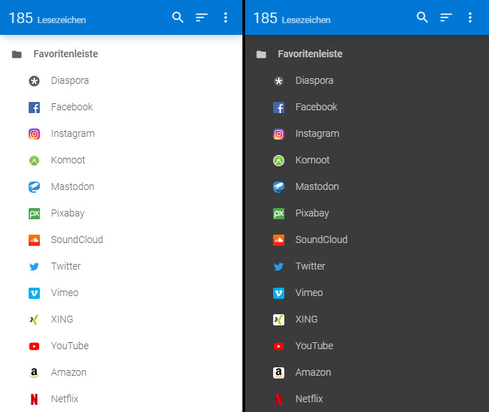

# Bookmark Sidebar Auto Dark Mode

### Automatically switches to dark mode when activated in the operating system

With the extension [Bookmark Sidebar](https://chrome.google.com/webstore/detail/bookmark-sidebar/jdbnofccmhefkmjbkkdkfiicjkgofkdh) you can only switch to Light or Dark Mode manually. With this CSS adjustment `@media (prefers-color-scheme: dark)` automatically switches to dark mode.

* style.css - Is the regular code.

* dark-reader.css - You only need this code if you use the Dark Reader extension. 

Insert CSS with Stylus for [Chrome](https://chrome.google.com/webstore/detail/stylus/clngdbkpkpeebahjckkjfobafhncgmne) or [Firefox](https://addons.mozilla.org/de/firefox/addon/styl-us/)

Or use Premium für your custom stylesheet. The developer will thank you for it ;-)

_Version: 1.0.0_

_Date: 2019-11-23_
